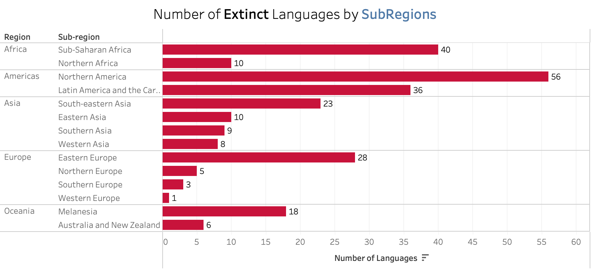
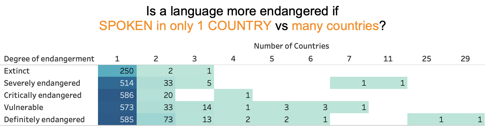

# Project 1: Extinct Languages

### Project Creation Date: September 2021

For those of you who speak more than one language, have you noticed that you think differently in each language and that some concepts exist in one language but not in others?  So if we lose a language, what else are we losing with it?

According to Ethnologue, there are 7,139 languages spoken in the world at the time of this project. But that number is constantly in flux.  As time goes by, new languages are discovered, some languages become endangered or vulnerable, while others become extinct.  

Roughly 40% of languages are now endangered, often with less than 1,000 speakers remaining.

The dataset I am working with comes from [The Guardian](https://www.theguardian.com/news/datablog/2011/apr/15/language-extinct-endangered#data), who in turn, sourced the data from [UNESCO](http://www.unesco.org/languages-atlas/en/atlasmap.html#) in 2017.  They indicate 228 extinct languages on record.

## Dataset
The full detailed dataset can be downloaded [here](https://docs.google.com/spreadsheets/d/1mUYwl5ZUTp2OHDr0hsco89YY5J8Qx2GWzTLFETzVnB4/edit?hl=en&hl=en#gid=1).  
It includes the _names of languages_, _number of speakers_, the _names of countries where the language is still spoken_, and the _degree of endangerment_. 

### Classification
The UNESCO endangerment classification is as follows: 
- **Extinct**: there are no speakers left
- **Critically endangered**: the youngest speakers are grandparents and older, and they speak the language partially and infrequently 
- **Severely endangered**: language is spoken by grandparents and older generations while the parent generation may understand it, they do not speak it to children or among themselves 
- **Definitely endangered**: children no longer learn the language as a 'mother tongue' in the home 
- **Vulnerable**: most children speak the language, but it may be restricted to certain domains (e.g., home)

## Initial Questions and Hypothesis  
- Where are these languages located?  Are they more concentrated in certain regions?
- My initial hypothesis is that most extinct languages were located in former British and Spanish Colonies.

So in order to answer these question, I had to supplement the data by scraping more datasets on countries according to their world regions, sub-regions, official languages and former colonizers. 

## Answers and Insights Visualized

As per the map above, there are large clusters of extinct, endangered and vulnerable languages between the tropics of Cancer and Capricorn, along the equator.

Most of these languages are located in the Americas

 

Most of the extinct languages come from North America while most endangered and vulnerable languages are in Latin America and the Caribbean.

From the chart above, a language is more likely to be extinct if it is only spoken in one country vs. spread out in different countries.
Romani is the endangered language spoken in the most number of countries (29), followed by Yiddish which is spoken in 25 countries.

  

A language is more likely to go extinct if it is from a country that only had one colonial power that ruled them.

A language is more likely to survive if the country it comes from had multiple colonial powers that took hold.  

The hypothesis at the beginning of this research was that most extinct languages took place in former British and Spanish Colonies. That is both correct and incorrect. 

As per the chart above, most of the extinct languages came from British and Spanish colonies respectively but it is British and French colonies that produced the most endangered and vulnerable languages. 

Lastly, as per the chart above, it is the English language that has pushed out the largest number of native languages.

### Data Limitations

There is a large number of null values in the number of speakers column in the original dataset, and it is impossible to obtain some of this information due to the remoteness of some of the speakers of said language. This is why I could not use this measure in my analysis. I had to rely on the *degrees of endangerment* data for most of my investigation and supplement it by adding the following columns: *Region, Sub-Region, Former Colony of, Official Language (if world's Top 10 Language).*

And since this study can be quite extensive, I decided to only study the effects of the top Western European colonies in the modern era (between 1500-1900). So this leaves out, in particular: 

**China**

As a whole, this country is still technically an empire since it includes many different cultures and ethnicities spread out over a very large area.  

**Russia** 

This country is not included as a former colonizer in my data although their influence still looms in Central Asia in the former Soviet states (eg. Tajikistan, Kyrgyzstan, Uzbekistan etc). They also only started their colonialism in the 1900

**Japan**  

This country only colonised countries for less than 5 years during WWII. 

**USA** 

Not a colonizer in the common sense of the word but they have been an imperial power for quite some time. 

Please also visit my [**Tableau Public**](https://public.tableau.com/app/profile/ruby.rondina/viz/ExtinctLanguages_16414222503700/Story1) to see interactive dashboards and the full story on this project.
